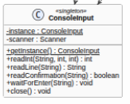
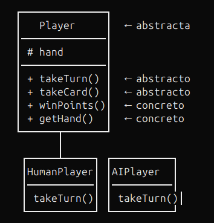

# Chinchón — Proyecto Final de Programación

Implementación del juego de cartas **Chinchón** en Java, desarrollada como proyecto final del módulo de Programación (CFGS DAM, IES Saladillo).

Este README documenta y justifica todas las decisiones técnicas, la estructura del proyecto, los patrones de diseño aplicados, las pruebas unitarias realizadas y la organización general del software, tal como se ha trabajado durante el curso en el módulo de Entornos de Desarrollo.

---

## Índice

1. [Explicación del juego](#explicación-del-juego)
2. [Estructura del proyecto](#estructura-del-proyecto)
3. [Diagrama de clases UML](#diagrama-de-clases-uml)
4. [Descripción de las clases](#descripción-de-las-clases)
5. [Patrones de diseño](#patrones-de-diseño)
6. [Pruebas unitarias](#pruebas-unitarias)
7. [JavaDoc](#javadoc)
8. [Requisitos del sistema](#requisitos-del-sistema)
9. [Restricciones académicas](#restricciones-académicas)

---

## Explicación del juego

### Objetivo

Ser el jugador con **menos puntos** al final de la partida, formando combinaciones de cartas (iguales o escaleras) o consiguiendo un **Chinchón** (victoria inmediata).

### Baraja

Se utiliza una baraja española de 40 cartas (sin 8 ni 9) con cuatro palos: Oros, Copas, Espadas y Bastos. Valores: 1–7 (valor nominal), Sota (10), Caballo (11), Rey (12).

### Jugadores

De 2 a 5 jugadores, pudiendo ser humanos o controlados por IA.

### Desarrollo de una ronda

1. **Reparto**: Cada jugador recibe 7 cartas. Se coloca un mazo boca abajo y una carta boca arriba (descarte).
2. **Turno**: Cada jugador roba una carta (del mazo o del descarte) y descarta una, o bien **cierra la ronda** si cumple las condiciones.
3. **Cierre**: El jugador que cierra debe tener 6 o 7 cartas combinadas. Si cierra con 7 combinadas, se restan 10 puntos. Si consigue un Chinchón (7 cartas consecutivas del mismo palo), gana la partida automáticamente.

### Combinaciones válidas

| Tipo | Descripción | Ejemplo |
|---|---|---|
| **Iguales** | ≥ 3 cartas del mismo número | 3🟡 3🔴 3⚔️ |
| **Escalera** | ≥ 3 cartas consecutivas del mismo palo | 5🔴 6🔴 7🔴 |
| **Chinchón** | 7 cartas consecutivas del mismo palo | 1🪵 2🪵 3🪵 4🪵 5🪵 6🪵 7🪵 |

### Puntuación

Al cierre de cada ronda, cada jugador suma los valores de sus cartas **no combinadas**. Cuando un jugador alcanza o supera los 100 puntos, queda eliminado. Gana el último jugador en pie.

### Capturas de pantalla

[insertar imagen de menú principal del juego]

[insertar imagen de turno de jugador humano mostrando la mano y opciones]

[insertar imagen de turno de IA mostrando decisiones automáticas]

[insertar imagen de cierre de ronda y puntuación]

[insertar imagen de pantalla de fin de partida con ganador]

---

## Estructura del proyecto

```
MauMau/                              # Proyecto Eclipse
├── src/                             # Código fuente
│   ├── app/                         # Lógica del dominio del juego
│   │   ├── Card.java                # Carta individual
│   │   ├── Rank.java                # Enum de valores
│   │   ├── Suit.java                # Enum de palos
│   │   ├── Deck.java                # Mazo de robo
│   │   ├── DiscardPile.java         # Pila de descarte
│   │   ├── Player.java              # Clase abstracta base
│   │   ├── HumanPlayer.java         # Jugador humano
│   │   ├── AIPlayer.java            # Jugador IA
│   │   ├── HandAnalyzer.java        # Analizador de combinaciones
│   │   └── GameManager.java         # Controlador del juego
│   ├── main/
│   │   └── Main.java                # Punto de entrada
│   └── tools/
│   │   ├── ConsoleInput.java        # Singleton de entrada
│   │   └── ConsoleOutput.java       # Utilidad de salida
│   ├── test/                        # Pruebas unitarias (JUnit 5)
│   │   └── HandAnalyzerTest.java    # Tests de HandAnalyzer
└──UML.png                          # Diagrama UML exportado

```

### Organización de carpetas

- **`src/`**: Contiene todo el código fuente del proyecto, organizado en paquetes por responsabilidad.
- **`src/app/`**: Paquete principal con las clases del dominio del juego (cartas, jugadores, lógica).
- **`src/main/`**: Punto de entrada de la aplicación.
- **`test/`**: Clases de prueba unitaria con JUnit 5.
- **`src/tools/`**: Utilidades de entrada/salida reutilizables.

---

## Diagrama de clases UML


El diagrama de clases se ha modelado con **PlantUML** y refleja la arquitectura completa del proyecto. Muestra:

- Los dos **enums** (`Suit`, `Rank`) con sus atributos y métodos.
- La clase **`Card`** como composición de `Suit` y `Rank`.
- Las clases **`Deck`** y **`DiscardPile`** como contenedores de cartas.
- La jerarquía de herencia: `Player` → `HumanPlayer` y `Player` → `AIPlayer`.
- La clase utilitaria **`HandAnalyzer`** (métodos estáticos).
- El controlador **`GameManager`** que orquesta el juego completo.
- Las clases de utilidad **`ConsoleInput`** (Singleton) y **`ConsoleOutput`** (métodos estáticos).
- Las relaciones de uso, creación y agregación entre clases.

---

## Descripción de las clases

### `Card` (`src/app/Card.java`)
Representa una carta de la baraja española. Es **inmutable**: su palo (`suit`) y valor (`rank`) se fijan en el constructor y no pueden modificarse. Proporciona acceso a sus atributos mediante getters.

### `Rank` (`src/app/Rank.java`)
**Enum** que modela los 10 valores de la baraja: UNO (1) a SIETE (7), SOTA (10), CABALLO (11), REY (12). El `ordinal()` de cada constante sigue el orden natural del juego, utilizado para detectar escaleras. `getValue()` devuelve la puntuación de cada carta.

### `Suit` (`src/app/Suit.java`)
**Enum** que modela los 4 palos: OROS, COPAS, ESPADAS, BASTOS. Cada constante tiene asociado un símbolo emoji (`getSymbol()`) para la representación visual.

### `Deck` (`src/app/Deck.java`)
Mazo de 40 cartas. Permite barajar (`shuffle`), robar la carta superior (`draw`), consultar la cima (`getTopCard`) y recargarse desde el descarte (`refill`), hasta un máximo de 2 reinicios por ronda.

### `DiscardPile` (`src/app/DiscardPile.java`)
Pila de descarte. Permite añadir cartas (`add`), robar la superior (`takeTop`), consultarla sin robar (`peek`) y extraer todas las cartas excepto la superior para recargar el mazo (`takeAllButTop`).

### `Player` (`src/app/Player.java`) — *abstracta*
Clase base que gestiona el estado común de cualquier jugador: la mano (`hand`), la puntuación acumulada (`points`) y el estado de eliminación (`isEliminated`). Declara los métodos abstractos `takeTurn`, `takeCard` y `discardCard` que las subclases implementan.

### `HumanPlayer` (`src/app/HumanPlayer.java`)
Jugador controlado por humano. En su turno, muestra la mano, pregunta si desea robar del descarte o del mazo, ofrece cerrar si es posible, y valida la carta a descartar al cerrar. Toda la interacción se realiza mediante `ConsoleInput`.

### `AIPlayer` (`src/app/AIPlayer.java`)
Jugador controlado por computadora con estrategia **greedy**: roba del descarte solo si mejora el número de cartas combinadas, cierra en cuanto puede, y descarta la carta suelta de mayor valor (o la de menor valor de un grupo si todas están combinadas).

### `HandAnalyzer` (`src/app/HandAnalyzer.java`)
Clase de **utilidad** con métodos estáticos. Implementa:
- **Detección de iguales** (`findGroups`): agrupa cartas del mismo rango (≥ 3).
- **Detección de escaleras** (`findRuns`): busca secuencias consecutivas del mismo palo.
- **Selección óptima** (`findBestCombinations`): mediante búsqueda recursiva exhaustiva, elige la combinación de grupos no solapados que cubre más cartas.
- **Verificación de cierre** (`canClose`, `isValidCloseHand`): comprueba si una mano puede cerrar la ronda según las reglas.
- **Selección de descarte** (`getBestDiscardForClose`): encuentra la carta cuyo descarte minimiza los puntos no combinados.

### `GameManager` (`src/app/GameManager.java`)
Controlador principal del juego. Gestiona el ciclo de vida completo: menús, creación de jugadores, bucle multirronda, reparto de cartas, despacho de turnos, puntuación, eliminación y detección de victoria.

### `ConsoleInput` (`src/tools/ConsoleInput.java`)
Clase que envuelve `Scanner` para proporcionar entrada validada por consola. Implementa el patrón **Singleton** para evitar múltiples recursos `Scanner` sobre `System.in`.

### `ConsoleOutput` (`src/tools/ConsoleOutput.java`)
Clase con métodos estáticos que centraliza todo el formato de salida por consola. Proporciona métodos para imprimir manos, puntuaciones, separadores, cabeceras y mensajes de error.

---

## Patrones de diseño

### Singleton — `ConsoleInput`

**Archivo**: `src/tools/ConsoleInput.java`

**Problema**: La clase `Scanner` de Java, al envolver `System.in`, no debe instanciarse más de una vez en la misma aplicación, ya que podrían solaparse lecturas y consumir recursos innecesariamente.

**Solución**: Se aplica el patrón **Singleton** para garantizar que solo exista una única instancia de `ConsoleInput` durante toda la ejecución.

**Cómo funciona**: El constructor es privado, y el acceso se realiza mediante el método estático `getInstance()`, que crea la instancia la primera vez que se solicita (lazy initialization) y la reutiliza en adelante.

```java
private static ConsoleInput instance;

private ConsoleInput() {
    this.scanner = new Scanner(System.in);
}

public static ConsoleInput getInstance() {
    if (instance == null) {
        instance = new ConsoleInput();
    }
    return instance;
}
```

**Justificación**: Es la solución estándar para recursos compartidos no reentrantes. Alternativas como pasar un `Scanner` por parámetro a todas las clases aumentarían el acoplamiento sin beneficio real.

.

### Utility Class — `HandAnalyzer` y `ConsoleOutput`

**Archivos**: `src/app/HandAnalyzer.java` y `src/tools/ConsoleOutput.java`

**Problema**: Ciertas operaciones (análisis de combinaciones, formateo de salida) son puramente funcionales y no necesitan mantener estado entre llamadas.

**Solución**: Se implementan como **clases de utilidad** con todos los métodos estáticos. No se pueden instanciar (constructor privado implícito) y agrupan operaciones relacionadas sin estado compartido.

**Justificación**: Evita crear objetos sin estado solo para agrupar métodos, reduce la huella de memoria y simplifica las llamadas (`HandAnalyzer.canClose(mano, ...)` en lugar de `new HandAnalyzer().canClose(...)`).

### Template Method — Jerarquía `Player` / `HumanPlayer` / `AIPlayer`

**Archivos**: `src/app/Player.java`, `src/app/HumanPlayer.java`, `src/app/AIPlayer.java`

**Problema**: Todos los jugadores comparten el mismo estado (mano, puntos, eliminación) y operaciones base, pero cada tipo de jugador tiene una lógica de turno diferente.

**Solución**: Se define una **clase abstracta** `Player` con los métodos comunes implementados y métodos abstractos (`takeTurn`, `takeCard`, `discardCard`) que cada subclase concreta implementa según su comportamiento.

**Justificación**: Este patrón permite:
- Reutilizar el código común (gestión de mano, puntuación) en un solo sitio.
- Garantizar que todas las subclases tengan la misma interfaz.
- Añadir nuevos tipos de jugador en el futuro sin modificar el código existente (principio Open/Closed).

```java
public abstract class Player {
    protected List<Card> hand;
    private String name;
    private int points;
    private boolean isEliminated;

    public abstract boolean takeTurn(Deck deck, DiscardPile pile, int roundTurn);
    public abstract boolean takeCard(Card card);
    public abstract Card discardCard(int index);
    // ... métodos concretos compartidos
}
```



---

## Pruebas unitarias

### Enfoque general

Las pruebas se han implementado con **JUnit 5** utilizando **tests parametrizados** (`@ParameterizedTest`) para evitar código repetitivo y cubrir múltiples casos con un solo método de prueba. Los tests se centran en la clase `HandAnalyzer`, que contiene la lógica más compleja y con más casos límite del proyecto.

**Archivo de pruebas**: `test/HandAnalyzerTest.java`

### Cobertura de pruebas

| Método probado | Caja blanca | Caja negra |
|---|---|---|
| `isChinchon()` |  | Casos: chinchón completo, mismo palo no consecutivo, distinto palo |
| `canClose()` | Turnos (< 2), punto límite (≥ 100) | Casos: mano cerrable, mano no cerrable |
| `isValidCloseHand()` | Frontera: valor 5 en carta suelta | Casos: 7 combinadas, 6 combinadas con/sin ≤ 5 |
| `combinedCountForHand()` |  | Combinaciones mixtas: iguales + escaleras |
| `getUnmatchedCards()` |  | 0, 1, 4, 7 cartas sin combinar |
| `getBestDiscardForClose()` |  | Descarta la carta de mayor valor no combinada |

### Pruebas de caja blanca

Se han diseñado pruebas que recorren caminos específicos del código:

- **`canClose_enTurnoMenorDeDos_devuelveFalse`**: Verifica la guarda `roundTurn < 2`, probando con turnos 0 y 1.
- **`canClose_conPuntosEnOSobreLimite_devuelveFalse`**: Verifica la guarda `accumulatedPoints >= pointLimit`, probando valores 100, 101, 150, 200.
- **`isChinchon_con6Cartas_devuelveFalse`**: Verifica la guarda `hand.size() != 7`.
- **`isValidCloseHand_conCartaSueltaEnFrontera`**: Prueba el valor frontera 5 en la carta suelta (≤ 5 → true, > 5 → false).

### Pruebas de caja negra

Se han diseñado pruebas que verifican el comportamiento esperado sin conocer la implementación interna:

- **`isChinchon_devuelveResultadoEsperado`**: 6 casos que cubren chinchón verdadero y falso.
- **`isValidCloseHand_devuelveResultadoEsperado`**: 5 casos que cubren manos válidas e inválidas.
- **`combinedCountForHand_devuelveNumeroEsperado`**: 4 casos con distintas configuraciones de mano.
- **`getUnmatchedCards_devuelveCantidadEsperada`**: 5 casos con 0 a 7 cartas sin combinar.
- **`getBestDiscardForClose_descartaCartaConValorEsperado`**: 4 casos verificando la carta descartada.
- **`canClose_conManoCerrableYCondicionesValidas_devuelveTrue`**: 3 casos con turno y puntos válidos.
- **`canClose_conManoNoCerrable_devuelveFalse`**: 2 casos de manos que no pueden cerrar.

### Capturas de ejecución de tests

[]

[]

---

## JavaDoc

Todas las clases y métodos públicos del proyecto están documentados con **JavaDoc** en inglés, siguiendo las convenciones del módulo.

La documentación incluye:
- Descripción de cada clase y su responsabilidad.
- Descripción de cada método público.
- Parámetros (`@param`) con su propósito.
- Valor de retorno (`@return`) con su significado.
- Notas adicionales cuando es relevante.

Para generar la documentación HTML:

```
javadoc -d docs/ -sourcepath src/ -subpackages app main tools
```

[]

---

## Restricciones académicas

### Programación

- Enfoque orientado a objetos: `main` solo crea instancias y llama a métodos.
- Sin `break` ni `continue` en estructuras de control.
- Sin frameworks ni librerías externas (salvo JUnit para tests).
- `switch` con sintaxis de Java 14 (expresiones con `->`).
- Toda la entrada de usuario pasa por `ConsoleInput`.
- Nombres de clases, atributos y métodos en inglés.

### Entornos de Desarrollo

- Diagrama UML (PlantUML) actualizado con todas las clases y relaciones.
- JavaDoc completo en clases y métodos públicos.
- Pruebas unitarias con JUnit 5 (tests parametrizados con `@CsvSource` y `@ValueSource`).
- Patrones de diseño: Singleton, Utility Class, Template Method.
- Documentación del proyecto en este README.
