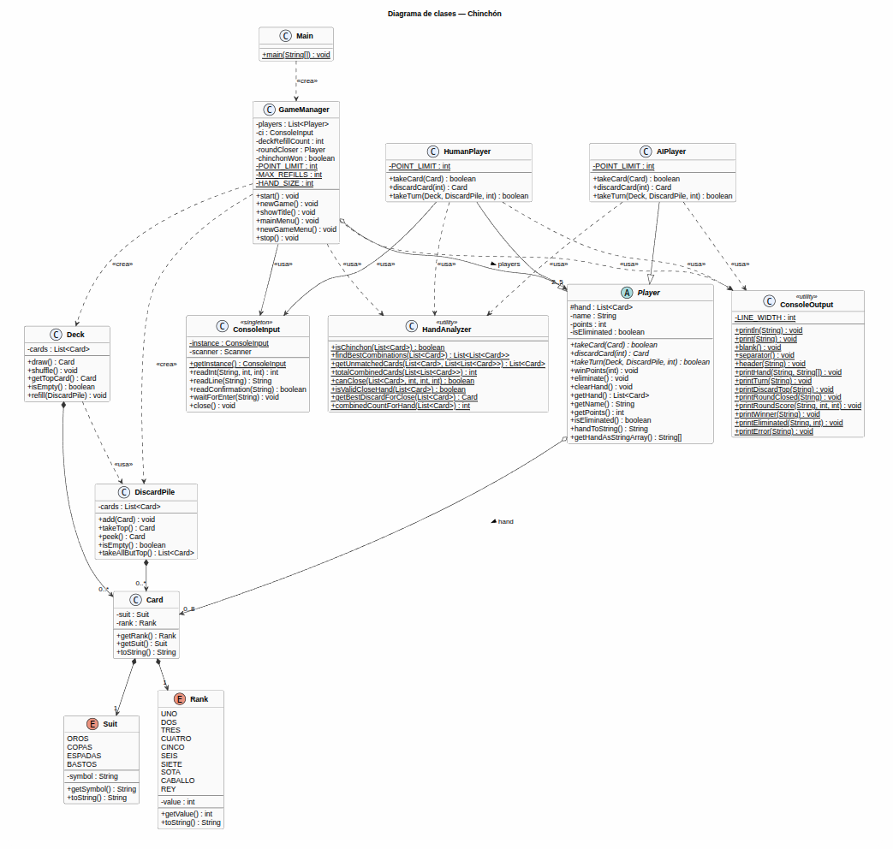

# Chinchón — Proyecto Final de Programación

Implementación del juego de cartas **Chinchón** en Java, desarrollada como proyecto final del módulo de Programación (CFGS DAM, IES Saladillo).

---

## Descripción del juego

Chinchón es un juego de cartas con baraja española (40 cartas, sin 8 ni 9) en el que participan de 2 a 5 jugadores. El objetivo es ser el jugador con **menos puntos** al final de la partida, formando combinaciones de cartas o consiguiendo un Chinchón.

### Combinaciones válidas

| Tipo | Descripción | Ejemplo |
|---|---|---|
| **Iguales** | ≥ 3 cartas del mismo número | 3🟡 3🔴 3⚔️ |
| **Escalera** | ≥ 3 cartas consecutivas del mismo palo | 5🔴 6🔴 7🔴 |
| **Chinchón** | 7 cartas consecutivas del mismo palo | 1🪵 2🪵 3🪵 4🪵 5🪵 6🪵 7🪵 |

### Desarrollo de una ronda

1. Se reparten **7 cartas** a cada jugador. Se coloca un mazo boca abajo y una carta boca arriba (descarte).
2. En su turno, cada jugador:
   - Roba una carta (del mazo o del descarte).
   - Descarta una carta, **o bien cierra la ronda** si cumple las condiciones.

### Condiciones para cerrar

- No puede ser el primer turno del jugador en la ronda.
- El jugador debe tener **6 o 7 cartas combinadas**:
  - Con **7 combinadas** → se restan 10 puntos al cerrador.
  - Con **6 combinadas** → la carta suelta debe valer **≤ 5 puntos**.
- El jugador no puede cerrar si su puntuación acumulada alcanza o supera el límite.

### Puntuación

Al cierre de cada ronda, cada jugador suma los valores de sus cartas **no combinadas**:

| Carta | Puntos |
|---|---|
| 1 – 7 | Su valor numérico |
| Sota | 10 |
| Caballo | 11 |
| Rey | 12 |

### Fin de partida

- Un jugador que alcanza o supera **100 puntos** queda eliminado.
- Gana el **último jugador en pie**, o quien consiga un **Chinchón** (victoria inmediata, no válida en el primer turno).
- Si todos los jugadores se eliminan en la misma ronda, gana el de menor puntuación.

---

## Requisitos del sistema

- **Java 17** o superior (se usa `switch` con expresiones de Java 14+).
- No requiere librerías externas.


---

## Estructura del proyecto

```
MauMau/
├── src/
│   ├── app/                   # Lógica del juego
│   │   ├── Card.java          # Carta individual (palo + valor)
│   │   ├── Rank.java          # Enum de valores (1–7, Sota, Caballo, Rey)
│   │   ├── Suit.java          # Enum de palos (Oros, Copas, Espadas, Bastos)
│   │   ├── Deck.java          # Mazo de robo con soporte de reinicio
│   │   ├── DiscardPile.java   # Pila de descarte
│   │   ├── Player.java        # Clase abstracta base de jugadores
│   │   ├── HumanPlayer.java   # Jugador humano (entrada por consola)
│   │   ├── AIPlayer.java      # Jugador IA (estrategia greedy)
│   │   ├── HandAnalyzer.java  # Detección de combinaciones y lógica de cierre
│   │   ├── GameManager.java   # Controlador principal del juego
│   │   └── Main.java          # (no usado; punto de entrada en src/main)
│   ├── main/
│   │   └── Main.java          # Punto de entrada principal
│   └── tools/
│       ├── ConsoleInput.java  # Singleton para lectura validada de consola
│       └── ConsoleOutput.java # Métodos estáticos de salida formateada
└── bin/                       # Clases compiladas (generadas por javac)
```

---

## Descripción de las clases

### `Card`
Representa una carta de la baraja española. Inmutable: suit y rank se fijan en el constructor.

### `Rank` / `Suit`
Enums que modelan los valores y palos de la baraja. `Rank.ordinal()` define el orden natural para detectar escaleras.

### `Deck`
Mazo de 40 cartas. Permite barajar (`shuffle`), robar (`draw`) y reiniciarse a partir del descarte (`refill`), hasta un máximo de 2 veces por ronda.

### `DiscardPile`
Pila de descarte. Permite robar la carta superior (`takeTop`), consultarla sin robar (`peek`) y extraer todas menos la superior para recargar el mazo (`takeAllButTop`).

### `Player` (abstracta)
Gestiona la mano, la puntuación acumulada y el estado de eliminación. Las subclases implementan `takeTurn`, que devuelve `true` si el jugador cierra la ronda.

### `HumanPlayer`
Turno interactivo: muestra la mano, pregunta de dónde robar, ofrece cerrar si es posible y valida la carta de descarte al cerrar.

### `AIPlayer`
Turno automático: roba del descarte si mejora las combinaciones, cierra en cuanto puede, y descarta la carta suelta de mayor valor.

### `HandAnalyzer`
Clase de utilidad estática. Detecta iguales y escaleras, encuentra la partición óptima de la mano mediante búsqueda recursiva exhaustiva, determina si una mano puede cerrar y selecciona la mejor carta a descartar al cerrar.

### `GameManager`
Controlador principal. Gestiona los menús, el bucle multi-ronda, el reparto de cartas, el despacho de turnos, la puntuación por ronda, la eliminación de jugadores y la condición de victoria.

### `ConsoleInput` / `ConsoleOutput`
Clases de utilidad para entrada/salida. `ConsoleInput` es un singleton que valida enteros en rango, confirmaciones y líneas de texto. `ConsoleOutput` centraliza todo el formato de pantalla.

---

## Diagrama de clases

El fichero `MauMau/diagrama_clases.puml` contiene el diagrama en formato PlantUML.



---

## Restricciones académicas aplicadas

### Programación 
- Enfoque orientado a objetos: `main` solo crea instancias y llama a métodos.
- Sin `break` ni `continue` en estructuras de control.
- Sin frameworks ni librerías externas.
- `switch` con sintaxis de Java 14 (expresiones con `->`).
- Toda la entrada de usuario pasa por `ConsoleInput`.
- Nombres de clases, atributos y métodos en inglés.

### Entornos de desarrollo
- Diagrama UML
- JUnit (test en tiempo de desarrollo)
- Aplicación de patrones de diseño (Singleton en la clase `ConsoleOutput`)

